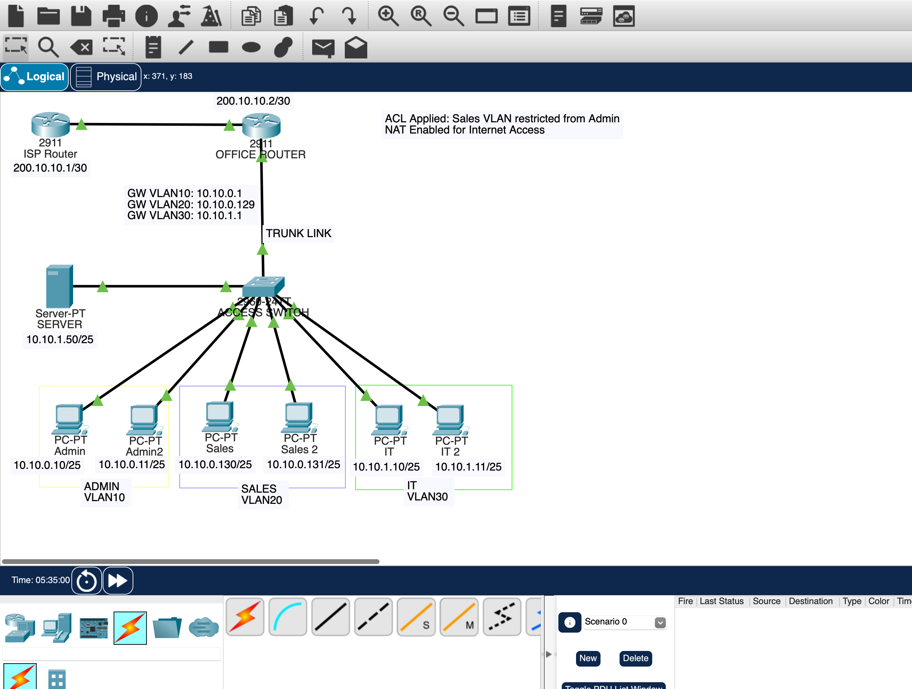

# 🏥 OtahnificentGuard365 — Secure Healthcare Network Design

## 📌 Overview

This project simulates a secure healthcare network designed to ensure proper segmentation, controlled access, and secure internet connectivity using enterprise networking principles.

Built using Cisco Packet Tracer, the network demonstrates real-world concepts including VLAN segmentation, inter-VLAN routing, NAT, and firewall-like access control.

---

## 🎯 Objectives

* Segment departments using VLANs
* Enable inter-VLAN communication
* Restrict unauthorized access between departments
* Provide secure internet access using NAT
* Simulate firewall behavior for external protection

---

## 🏗️ Network Design

### VLAN Structure

| VLAN | Department | Subnet         | Gateway     |
| ---- | ---------- | -------------- | ----------- |
| 10   | Admin      | 10.10.0.0/25   | 10.10.0.1   |
| 20   | Sales      | 10.10.0.128/25 | 10.10.0.129 |
| 30   | IT         | 10.10.1.0/25   | 10.10.1.1   |

---

## 🔧 Technologies Used

* VLANs (Network Segmentation)
* Router-on-a-Stick (Inter-VLAN Routing)
* ACL (Access Control Lists)
* NAT (Network Address Translation)
* Basic Firewall Logic (Edge Security)

---

## 🔒 Security Implementation

* Sales VLAN restricted from accessing Admin VLAN
* Internal network protected from external access
* NAT used to mask internal IP addresses
* Controlled communication between VLANs

---

## 🌐 Network Topology

---

## ⚙️ Configuration

### Router Configuration

See: `/configs/router-config.txt`

### Switch Configuration

See: `/configs/switch-config.txt`

---

## 🧪 Testing & Validation

### ✅ Successful Tests

* Admin PC can access ISP (internet simulation)
* IT VLAN has full internal access
* Inter-VLAN routing functioning correctly

### ❌ Blocked Tests

* Sales VLAN cannot access Admin VLAN
* External network cannot access internal network

---

## 📸 Screenshots

### Successful Internet Access

### Blocked Access (Security Enforcement)

### NAT Translation Table

---

## 🧠 Key Learnings

* VLAN segmentation improves network organization and security
* ACLs enforce access control between departments
* NAT enables secure communication with external networks
* Network design must align with both operational and security needs

---

## 🚀 Future Improvements

* Implement DMZ for public-facing services
* Introduce dynamic routing (OSPF)
* Simulate enterprise firewall (Palo Alto / ASA)

---

## 👤 Author

Otaoghene Onoghojebi
Network & IT Support Engineer
